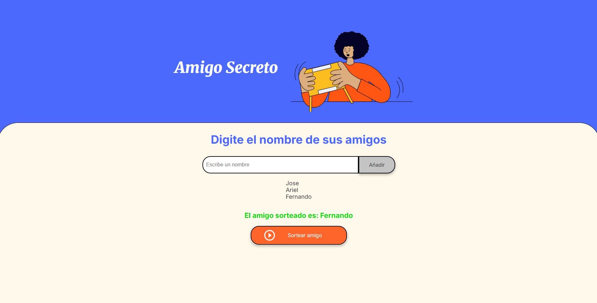

# Aplicación Web de Amigo Secreto

## Descripción

Esta es una pequeña aplicación web para realizar sorteos de amigo secreto entre un grupo de personas

Cuenta con un input central donde se pueden añadir nombres de amigos que se irán mostrando en una lista debajo del campo de entrada

Una vez añadidos al menos dos amigos, se puede hacer clic en el botón de sorteo para mostrar aleatoriamente a uno de los participantes

## Instalación

Puedes clonar este repositorio y ejecutarlo localmente con un servidor estático como Live Server

1. Clona el repositorio
   git clone https://github.com/fnandoth/challenge-amigo-secreto.git

2. Ingresa a la carpeta del proyecto
   cd amigo-secreto 

3. Abre el proyecto con Live Server o cualquier servidor estático de tu preferencia

## Captura de pantalla 

